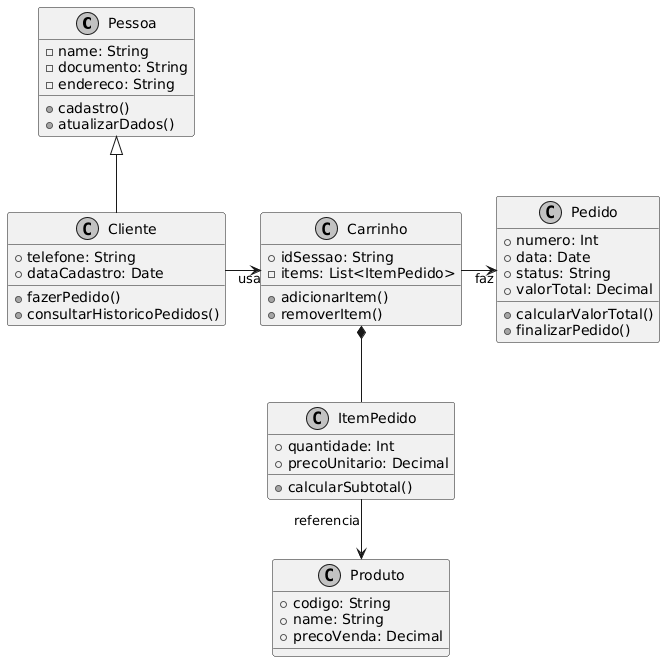

# Sistema de Vendas para Varejo - TOO 2025-2

**Aluno:** [Rodrigo Pereira Barbosa]  
**Tema:** Sistema de Vendas para Varejo

## Pilares da POO Aplicados
- **Abstração**: Classe abstrata `Pessoa`
- **Encapsulamento**: Todos os atributos privados (`__`) com properties
- **Herança**: `Cliente` herda de `Pessoa`
- **Polimorfismo**: Método `tipo_pessoa()` sobrescrito

## Padrões de Projeto Implementados (3 no total)
|--------------|------------------------------------------|------------|
| **Factory**  | `PedidoFactory.criar_pedido()`           | Centraliza criação de pedidos e numeração automática |
| **Singleton**| `GerenciadorEstoque.get_instance()`      | Garante único ponto de controle do estoque |
| **Strategy** | `DescontoStrategy` + classes concretas   | Permite trocar estratégia de desconto dinamicamente |

## Diagrama de Classes UML


## Como executar
```bash
python main.py  