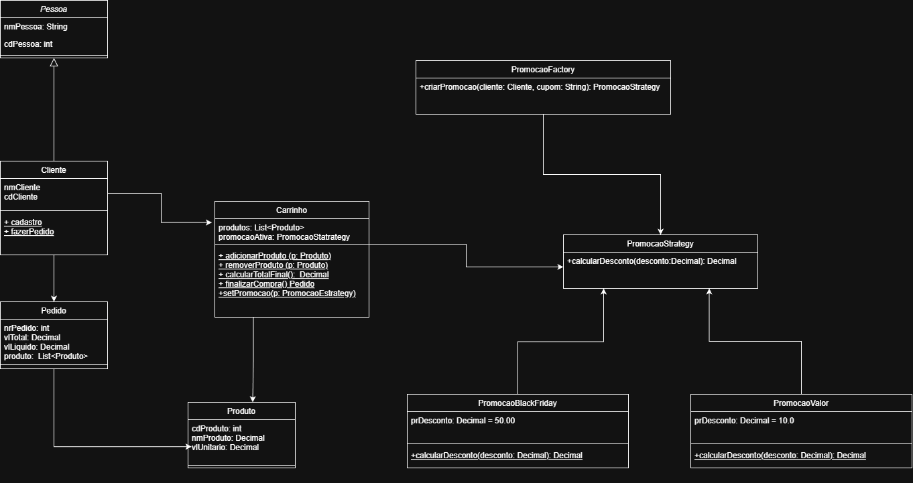

# Sistema de Vendas para Varejo - TOO 2025-2

**Aluno:** [Rodrigo Pereira Barbosa]  
**Aluno:** [Vanessa Lago Machado]  

**Tema:** Sistema de Vendas para Varejo

Este arquivo `README.md` fornece uma visão geral do projeto do sistema de vendas, explicando sua estrutura, os conceitos de Programação Orientada a Objetos (POO) aplicados e as instruções para execução. O projeto foi desenvolvido como parte da Avaliação Prática e da Atividade Extra da disciplina de Tecnologia Orientada a Objetos (TOO).

## Descrição do Projeto
Este projeto consiste em um sistema de vendas simplificado para varejo. O sistema permite simular o cadastro de promoções (cupons), a realização de compras com adição e remoção de produtos em um carrinho, a aplicação de descontos baseados em estratégias e a finalização de pedidos, mantendo um histórico das vendas realizadas.

## Estrutura do Projeto
O projeto está organizado nos seguintes arquivos e diretórios:

## Aplicação dos Pilares da POO

O projeto demonstra a aplicação dos quatro pilares fundamentais da Programação Orientada a Objetos

1.  **Abstração**: Classes como `Pessoa`, `Produto` e a interface `PromocaoStrategy` modelam conceitos do mundo real, focando em suas características e comportamentos essenciais.
2.  **Encapsulamento**: Os dados (atributos) e comportamentos (métodos) estão agrupados em suas respectivas classes. O acesso e a modificação do estado dos objetos são controlados por métodos específicos.
3.  **Herança**: A classe `Cliente` herda atributos e métodos da classe base `Pessoa`. As classes de promoção concretas herdam da classe abstrata `PromocaoStrategy`.
4.  **Polimorfismo**: O método `calcularDesconto` na interface `PromocaoStrategy` possui diferentes implementações nas subclasses (`PromocaoBlackFriday`, `PromocaoValor`). O sistema chama esse método sem precisar conhecer a classe concreta exata, e o comportamento correto é executado.

## Padrões de Projeto Utilizados

Além dos pilares da POO, o projeto implementa padrões de projeto, conforme exigido

1. **Factory Pattern (Padrão de Criação)**: Implementado na classe `PromocaoFactory` Esta classe centraliza a lógica de criação dos objetos de estratégia de promoção, permitindo que o sistema instancie a promoção correta sem acoplar o código às classes concretas.
2. **Strategy Pattern (Padrão Comportamental)**: Implementado através da interface `PromocaoStrategy` e suas subclasses concretas (`PromocaoBlackFriday`, `PromocaoValor`). Este padrão permite encapsular diferentes algoritmos de cálculo de desconto e torná-los intercambiáveis, facilitando a adição de novas regras de promoção sem alterar o código existente.

## Como executar
3.  **Execução**:
    * Abra o terminal ou prompt de comando.
    * Navegue até o diretório onde os arquivos do projeto foram salvos.
    * Execute o comando: `python main.py`
4.  **Testes**: O sistema apresenta um menu interativo no console. Utilize as opções do menu para simular o fluxo de vendas:
    * Cadastre uma promoção (ex: tipo 1, cupom "BF").
    * Realize uma nova compra, adicione produtos, aplique o cupom cadastrado e finalize o pedido.
    * Visualize o histórico de pedidos para verificar se a venda foi registrada corretamente com os descontos aplicados.

